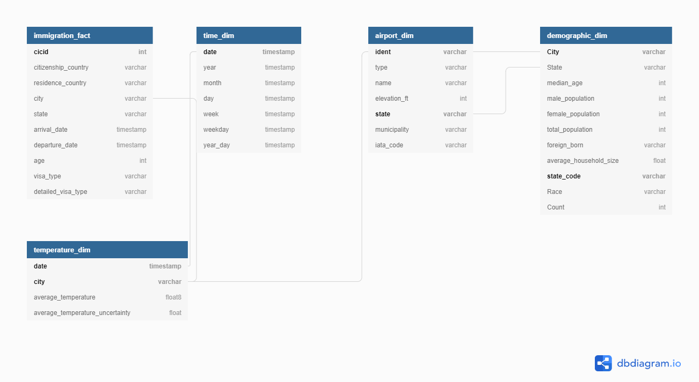

# Analysis of Immigration Data in the United States

This is the Capstone for the Data Engineering program at Udacity. This project aims at structuring United States immigration data with the intent of analyzing the following aspects:
- <i>Correlation between travel volumes and the entry ports</i>     
- <i>Correlation between travel volumes and the variation of dempographics in different cities</i>
- <i>The seasonality componente of travelling
- <i>The impact of temperatures on travellers' volume</i>

## Getting Started

There are several datasets available for this study which are listed below. In specific, the full immigration dataset has approximately three million rows. 
    
* **I94 Immigration Data**: This data comes from the US National Tourism and Trade Office and includes the contents of the i94 form on entry to the united states. A data dictionary is included in the workspace.
* **countries.csv** : Country codes extracted from the data dictionary
* **i94portCodes.csv**: City codes used extracted from the data dictionary

* **World Temperature Data**: This data set comes from Kaggle, and includes temperatures from several cities worldwide from 1743 to 2013.
* **U.S. City Demographic Data**: This data set comes from OpenSoft, and includes US cities demographics from the US Census Bureau's 2015 American Community Survey.
* **Airport Code Table**: Airport codes and corresponding cities.
    
## Schema

<div align= "justify">Schema on read refers to an innovative data analysis strategy in new data-handling tools and other more involved database technologies. In schema on read, data is applied to a plan or schema as it is pulled out of a stored location, rather than as it goes in. More and more these days, data is a shared asset among groups of people with differing roles and differing interests who want to get different insights from that data; this approach is especially beneficial When delaing with increasingly large volume of data such as the immigration dataset in this project. With schema-on-read data can be presented in a schema that is adapted best to the queries being issued rather than being limited by a one-size-fits-all schema.</div>


The fact table is immigration_fact, and includes the following fields:
    
* cicid
* citizenship_country
* residence_country
* city
* state
* arrival_date
* departure_date
* age
* visa_type
* detailed_visa_type

Dimension tables are time_dim, airport_dim, demographic_dim, temperature_dim, and includes the following fields:

**time_dim** (aggretate data by time)
* date 
* year 
* month 
* day 
* week
* weekday
* year_day

**airport_dim** (determines area flow of travellers)
* ident
* type 
* name, 
* elevation_ft 
* state
* municipality 
* iata_code

**demographic_dim** (travellers origin areas demographic)
* City 
* State 
* median_age 
* male_population 
* female_population 
* total population
* foreign_born 
* average_Household_Size 
* state_code
* Race 
* Count

**temperature_dim**: (temperature data)
* date 
* city
* average temperature 
* average temperature uncertainty 


## Prerequisites

Python 3 is the environment utilized with the addition of the following libraries:

* __pyspark__ (+ dependencies) 
* __jupyter__ (+ dependencies) 

## Installing

```
from pyspark.sql import SparkSession
from pyspark.sql.functions import udf, date_add
from pyspark.sql.types import StringType
from pyspark.sql.types import IntegerType
from pyspark.sql.functions import desc
from pyspark.sql.functions import asc
from pyspark.sql.functions import sum as Fsum
import datetime
import numpy as np
import pandas as pd
import seaborn as sns
import matplotlib.pyplot as plt
```

## Deployment


* Capstone Project Template.ipynb**: Jupyter Notebook that executes the project' steps listed below:


* Step 1: Scope the Project and Gather Data
* Step 2: Explore and Assess the Data
* Step 3: Define the Data Model
* Step 4: Run ETL to Model the Data
* Step 5: Complete Project Write Up


### _Acknowledgments_

* Chapeau to StackOverflow, GitHub, and Udacity Knowledge platforms for providing some guidance code.
